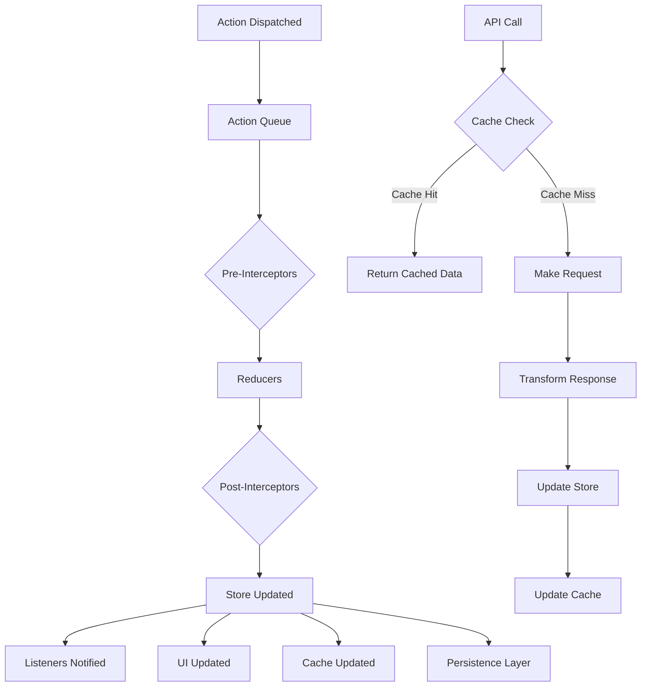

# Sedux

A powerful state management library for Svelte applications that combines Redux-like patterns with Svelte's reactivity system.

This library is compatible with svelte 5 only

> ⚠️ **Warning**
> - This library is currently in beta stage
> - Documentation is still under development
> - Some features may contain bugs
> - Please report any issues on GitHub repository
> - We welcome and encourage community contributions!

## Table of Contents

1. [Overview](#overview)
2. [Installation](#installation)
3. [Quick Start](#quick-start)
4. [Core Concepts](#core-concepts)
   - [Store Management](#store-management)
   - [Actions and Reducers](#actions-and-reducers)
   - [Selectors](#selectors)
   - [Interceptors](#interceptors)
   - [Listeners](#listeners)
5. [Advanced Features](#advanced-features)
   - [Async Operations](#async-operations)
   - [Persistence](#persistence)
   - [DevTools](#devtools)
6. [Toolkit](#toolkit)
   - [API Integration](#api-integration)
   - [Cache Management](#cache-management)
   - [Enhanced Slices](#enhanced-slices)
   - [Toolkit Exports](#toolkit-exports)
   - [WebSocket Integration](#websocket-integration)
7. [Data Flow](#data-flow)
8. [API Reference](#api-reference)
9. [TypeScript Support](#typescript-support)
10. [Examples](#examples)
11. [Contributing](#contributing)
12. [License](#license)
13. [Error Handling](#error-handling)
14. [Best Practices](#best-practices)

## Overview

Sedux is a state management solution that brings Redux-like patterns to Svelte while leveraging Svelte's built-in reactivity system. It provides:

- 🔄 Redux-like state management with Svelte's reactivity
- ⚡ Seamless Svelte store integration
- 📦 Predictable action dispatching and handling
- 🔌 Powerful middleware/interceptor system
- ⏳ First-class async state management
- 🛠️ Built-in Redux DevTools support
- 💾 Flexible persistence options
- 📝 Full TypeScript support

## Installation

```bash
# Using npm
npm install @sedux/svelte

# Using yarn
yarn add @sedux/svelte

# Using pnpm
pnpm add @sedux/svelte
```

## Quick Start

Here's a basic counter example to get you started:

````svelte
<script lang="ts">
import { Sedux, createSlicer, dispatch, select } from '@sedux/svelte';

// 1. Create a slice of state
const [counterSlice, counterActions] = createSlicer({
  name: 'counter',
  initialState: { count: 0 },
  reducers: {
    increment: (state, action) => ({ value: state.value + 1 }),
    addAmount: (state ,action: ActionWithPayload<number>) => ({
      value: state.value + action.payload
    })
  }
});

function handleIncrement() {
  counterActions.increment();
}

function handleAddAmount(amount: number) {
counterActions.addAmount(amount);
}
</script>

<!-- 4. Wrap your app with Sedux -->
<Sedux>
  <div>
    <p>Current count: {counterSlice.value.count}</p>
    <button onclick={handleIncrement}>
      Increment
    </button>
    <button onclick={() => handleAddAmount(5)}>
      Add 5
    </button>
  </div>
</Sedux>

### Initialization


// 1. Import Sedux
import { Sedux } from '@sedux/svelte';

// 2. Wrap your app
<Sedux>
  <App />
</Sedux>
````

## Core Concepts

### Store Management

Sedux provides several ways to manage your application state:

#### Basic Store

```typescript
import { storex, select } from "@sedux/svelte";

// Create a store
const store = storex({ count: 0 });

// Create a derived store
const count = $derived(store.value, (state) => state.count);

// use in component
count; // Reactive value
```

#### State Slices

```typescript
import { createSlicer } from "@sedux/svelte";

interface CounterState {
	value: number;
	lastUpdated: Date;
}

const counterSlice = createSlicer({
	name: "counter",
	initialState: {
		value: 0,
		lastUpdated: new Date(),
	} as CounterState,
	reducers: {
		increment: (state, action) => ({
			...state,
			value: state.value + 1,
			lastUpdated: new Date(),
		}),
	},
});
```

### Actions and Reducers

Actions are payloads of information that send data to your store:

```typescript
// Action Types
interface Action {
	type: string | symbol;
	name?: string;
}

interface ActionWithPayload<T> extends Action {
	payload: T;
}

// Dispatching Actions
dispatch({ type: "increment" }, "counter");
dispatch(
	{
		type: "addAmount",
		payload: 5,
	},
	"counter"
);

// Timed Actions
timedDispatch({ type: "increment" }, 5, "counter"); // After 5 minutes
```

### Interceptors

Interceptors provide a way to handle side effects and transform actions:

```typescript
import { createSmartInterceptor, addInterceptor } from "@sedux/svelte";

// Create an interceptor
const loggingInterceptor = createSmartInterceptor(async (payload, api) => {
	console.log("Before action:", payload);
	const result = await api.dispatch(payload);
	console.log("After action:", result);
	return result;
});

// Add pre-action interceptor
addInterceptor("ACTION_TYPE", loggingInterceptor, "pre");

// Add post-action interceptor
addInterceptor("ACTION_TYPE", loggingInterceptor, "post");

// Error handling
loggingInterceptor.rejected = (error, api) => {
	console.error("Action failed:", error);
};
```

### Listeners

Listeners allow you to react to actions:

```typescript
import { addListener, addOnceListener } from "@sedux/svelte";

// Persistent listener
const { destroy } = addListener("increment", (action) => {
	console.log("Counter incremented");
});

// One-time listener
addOnceListener(["increment", "decrement"], (action) => {
	console.log("Counter changed once");
});

// Cleanup
destroy(); // Remove listener when needed
```

## Advanced Features

### Async Operations

#### Async Slices

```typescript
const [userSlice] = await createSlicerAsync({
	name: "users",
	initialState: {
		data: [],
		loading: false,
		error: null,
	},
	reducers: {
		setLoading: (action, state) => ({ ...state, loading: true }),
		setData: (action: ActionWithPayload<user[]>, state) => ({
			...state,
			data: action.payload,
			loading: false,
		}),
		setError: (action: ActionWithPayload<Error>, state) => ({
			...state,
			error: action.payload,
			loading: false,
		}),
	},
});
```

#### Async Actions

```typescript
// Using async thunks
const fetchusers = createAsyncThunk(
	"users/fetch",
	async () => {
		const response = await fetch("/api/users");
		return response.json();
	},
	(response) => response.data // Optional result transformer
);

// Usage
const usersThunk = fetchusers("users");
await usersThunk();
```

### Persistence

Sedux offers flexible persistence options:

```typescript
// Local Storage persistence
const persistedSlice = createSlicer({
	name: "persisted",
	initialState: { value: 0 },
	reducers: {
		/*...*/
	},
	persist: localStorageAdapter, // or 'IndexedDBAdapter'
});


// Custom Storage
const customSlice = createSlicerAsync({
	name: "custom",
	initialState: { value: 0 },
	reducers: {
		/*...*/
	},
	persist: {}, //imeplement the StorageAdapter interface	
});
```

### DevTools

Redux DevTools integration is automatic when you wrap your app with `Sedux`:

```svelte
<script>
import { Sedux } from '@sedux/svelte';
</script>

<Sedux>
  <App />
</Sedux>
```

Features available in DevTools:

- Action logging with payloads
- State timeline
- Time-travel debugging
- Action replay
- State export/import

## Toolkit

### API Integration

The toolkit provides a powerful RTK Query-like API integration:

```typescript
import { createApi, baseQuery } from "@sedux/svelte";

const api = createApi({
	baseQuery: baseQuery("https://api.example.com"),
	endpoints: () => ({
		getPosts: {
			query: () => ({
				url: "/posts",
				method: "GET",
			}),
			transformResponse: (response) => response.data,
			cache: {
				ttl: 5000,
				key: "posts",
				autoRefresh: true,
			},
		},
		getPost: {
			query: (id: string) => ({
				url: `/post/${id}`,
				method: "GET",
			}),
			transformResponse: (response) => response.data,
			cache: {
				ttl: () => 5000,
				key: ([id]) => `post-${id}`,
				autoRefresh: true,
			},
		},
	}),
	reducerPath: "api",
});

// Regular usage in components
const [fetchPosts, posts] = api.useGetPostsQuery();

// Using unwrap for direct API calls
const makeRequest = api.useGetPostsQuery.unwrap();

// Basic unwrap usage
const result = await makeRequest();
// Returns: { data: T | null, error: any | null, status: "idle" | "loading" | "completed" | "failed" }

// With custom fetch implementation
const customFetch = api.useGetPostsQuery.unwrap(myCustomFetch);
const result = await customFetch();

// Handling results
const { data, error, status } = await makeRequest();
if (status === "completed") {
	// Handle success
	console.log(data);
} else if (status === "failed") {
	// Handle error
	console.error(error);
}
```

### Unwrap API

The `unwrap` functionality allows you to make API calls without store integration:

```typescript
interface UnwrappedResult<T> {
	data: T | null;
	error: any | null;
	status: "idle" | "loading" | "completed" | "failed";
}

// Each endpoint query hook provides an unwrap method
const { useGetPostsQuery } = api;

// Get the unwrapped function
const makeRequest = useGetPostsQuery.unwrap();

// Usage with parameters
const result = await makeRequest({ id: 1 });

// With custom fetch implementation
const customRequest = useGetPostsQuery.unwrap((url, options) => {
	return customFetch(url, {
		...options,
		headers: {
			...options.headers,
			Authorization: "Bearer token",
		},
	});
});

// Error handling
try {
	const { data, error, status } = await makeRequest();
	if (status === "completed") {
		return data;
	}
	throw new Error(error);
} catch (e) {
	// Handle error
}
```

Key features of unwrap:

- Direct API calls without store subscription
- Custom fetch implementation support
- Full type safety for parameters and responses
- Consistent error handling
- Status tracking
- Transforms and error handling still apply


### SvelteKit Data loading integration

- +page.server.ts/+page.ts
```typescript
export const load({fetch}) {
	const getData = useGetData.unwrap(fetch);

	const result = await getData();

	if (result.status === 'failed') {
		error(result.error.message)
	}

	return {
		result
	}
 }
```

- +page.svelte
```svelte
<script lang='ts'>

const {data} = $props();
const [getData, getState] = useGetData(data.result);
```

Now getState is hydrated with the serverside data and you can use all of the features of the library

### Cache Management

Sedux provides sophisticated cache management:

```typescript
const api = createApi({
	endpoints: () => ({
		getPosts: {
			query: () => ({ url: "/posts" }),
			// Cache configuration
			cache: {
				ttl: 5000, // Time to live in ms
				key: "posts", // Cache key
				autoRefresh: true, // Auto refresh on expiry
			},
			// Cache invalidation
			tag: "Posts",
			invalidateTags: ["Comments"],
		},
		addPost: {
			query: (post) => ({
				url: "/posts",
				method: "POST",
				body: post,
			}),
			// Invalidate cache after mutation
			invalidateTags: ["Posts"],
		},
	}),
});
```

### Enhanced Slices

The toolkit provides enhanced slice creation with additional features:

```typescript
import { createSlice } from "@sedux/svelte";

const [counterSlice, actions, store] = createSlice({
	name: "counter",
	initialState: { value: 0 },
	reducers: {
		increment: (action, state) => ({ value: state.value + 1 }),
		addAmount: (action: ActionWithPayload<number>, state) => ({
			value: state.value + action.payload,
		}),
	},
	// Optional async thunks
	thunks: [
		createAsyncThunk("counter/fetch", async () => {
			const response = await fetch("/api/counter");
			return response.json();
		}),
	],
	// Extra reducers for handling async actions
	extraReducers: {
		"counter/fetch/fulfilled": (action, state) => ({
			value: action.payload,
		}),
	},
	persisted: true,
});

// Accessing actions
actions.increment();
actions.addAmount(5);
```

### Search Parameters Integration

Sedux provides built-in support for syncing state with URL search parameters, allowing you to:
- Persist specific state values in the URL
- Control which fields are included/excluded
- Handle complex data types with base64 encoding
- Custom value parsing

```typescript
const [slice, actions, store] = createSlice({
  name: 'filters',
  initialState: {
    modal: {
      opened: false
    },
    search: '',
    filters: {
      category: 'all',
      price: { min: 0, max: 100 }
    }
  },
  reducers: {
    setModal: (action: ActionWithPayload<boolean>, state) => ({
      ...state,
      modal: { opened: action.payload }
    }),
    setSearch: (action: ActionWithPayload<string>, state) => ({
      ...state,
      search: action.payload
    })
  },
  searchParams: {
    enabled: true,
    // Specify which paths to include in URL
    include: ['modal.opened', 'search', 'filters'],
    // Exclude specific nested paths
    exclude: ['filters.price'],
    // Control when values should be added to URL
    shouldAppend: (value, path) => {
      if (path === 'search') return value.length > 0;
      return true;
    },
    // Custom value parsing (optional)
    parseValue: (value, path) => {
      if (path === 'modal.opened') return value === 'true';
      return JSON.parse(value);
    },
    // Navigation function (required for SvelteKit)
    goto: (url) => goto(url)
  }
});
```

### Toolkit Exports

```typescript
import { createApi, baseQuery } from "./toolkit";
import { createSlice } from "./toolkit";
import { createAsyncThunk } from "./toolkit";
```

These exports provide enhanced functionality similar to Redux Toolkit:

- `createApi`: RTK Query-like data fetching
- `createSlice`: Enhanced slice creation with simplified syntax
- `createAsyncThunk`: Async action creator utilities

## Data Flow



## API Reference

### Core Exports

#### Store Functions

```typescript
import { storex, select, dynamicSelect } from "@sedux/svelte";

// Create a store
const store = storex<State>(initialState);

// Create a derived
const value = $derived(store.value, (state) => state);

```

#### Action Dispatching

```typescript
import { dispatch, timedDispatch } from "@sedux/svelte";

// Immediate dispatch
await dispatch(
	{
		type: "actionType",
		payload: data,
	},
	"sliceName"
);

// Delayed dispatch (in minutes)
timedDispatch(
	{
		type: "actionType",
		payload: data,
	},
	5,
	"sliceName"
);
```

#### Event System

```typescript
import { addListener, addOnceListener } from "@sedux/svelte";

// Add persistent listener
const { destroy } = addListener("actionType", (action) => {
	// Handle action
});

// Add one-time listener
addOnceListener(["actionType1", "actionType2"], (action) => {
	// Handle action once
});
```

#### Interceptors

```typescript
import { createSmartInterceptor, addInterceptor } from "@sedux/svelte";

const interceptor = createSmartInterceptor(async (payload, api) => {
	// Handle action
});

addInterceptor("actionType", interceptor, "pre");
```

#### State Slices

```typescript
import { createSlicer, createSlicerAsync, createSlicerToolkit } from "@sedux/svelte";

// Synchronous slice
const slice = createSlicer({
	name: "slice",
	initialState,
	reducers: {
		/*...*/
	},
});

// Async slice
const asyncSlice = await createSlicerAsync({
	name: "async",
	initialState,
	reducers: {
		/*...*/
	},
});

// Toolkit slice
const toolkitSlice = createSlicerToolkit({
	name: "toolkit",
	initialState,
	reducers: {
		/*...*/
	},
});
```

### Type Definitions

```typescript
// Action Types
interface Action {
	type: symbol | string;
	name?: string;
	_id?: string;
}

interface ActionWithPayload<T> extends Action {
	payload: T;
}

// Store Types
interface Storex<T> extends Writable<T> {
	reset: () => void;
	resetAllSubscribers: () => void;
	unsubscribeById: (id: string) => void;
	get: () => T;
}

// Interceptor Types
interface InterceptorApi {
	getState: (name?: string) => any;
	dispatch: <A>(action: GeneralAction<A>) => void;
	dispatchGlobal: <A>(action: GeneralAction<A>, name: string) => void;
}

// Listener Types
interface ListenerDestroyable {
	listener: Listener;
	destroy: () => void;
}

//StorageAdapter interface
interface StorageAdapter {
	read: (name: string) => MaybePromise<any>;
	write: (name: string, value: any) => MaybePromise<void>;
	remove: (name: string) => MaybePromise<void>;
	clear: () => MaybePromise<void>;
	getKeys: () => MaybePromise<string[]>;
	hasKey: (name: string) => MaybePromise<boolean>;
}
```

## Error Handling

### API Errors

```typescript
const api = createApi({
  endpoints: (builder) => ({
    getPosts: {
      query: () => ({ url: '/posts' }),
      // Custom error transformation
      transformError: (error) => ({
        message: error.message,
        code: error.status
      }),
      // Error handling hook
      onError: (error, api) => {
        // Handle error
      }
    })
  })
});
```

### Interceptor Errors

```typescript
const interceptor = createSmartInterceptor(async (payload, api) => {
	// Your logic
});

// Error handling
interceptor.rejected = (error, api) => {
	// Handle error
};
```

## Best Practices

### State Organization

- Keep state slices small and focused
- use selectors for derived state
- Normalize complex data structures

### Performance

- use memoized selectors for expensive computations
- Implement proper cleanup in interceptors and listeners
- Leverage the cache system for API calls

### TypeScript

- Define interfaces for your state
- use strict action typing
- Leverage generic constraints

### Testing

- Test reducers in isolation
- Mock API calls in tests
- Test interceptors independently


### Type Inference

Sedux provides full type inference for:

- Store state
- Action payloads
- Selectors
- API responses

```typescript
// Example with full type safety
interface State {
	value: number;
}

const slice = createSlicer<State>({
	name: "typed",
	initialState: { value: 0 },
	reducers: {
		increment: (action, state): State => ({
			value: state.value + 1,
		}),
	},
});
```

## Examples

### Basic Counter

```svelte
<script lang="ts">
import { Sedux, createSlice, dispatch, select } from '@sedux/svelte';

const [counterSlice] = createSlice({
	name: 'counter',
	initialState: { value: 0 },
	reducers: {
		increment: (action, state) => ({ value: state.value + 1 }),
		decrement: (action, state) => ({ value: state.value - 1 }),
		addAmount: (action: ActionWithPayload<number>, state) => ({
			value: state.value + action.payload
		})
	}
});

const count = $derived(counterSlice.value, state => state.value);
</script>

<div>
	<h1>Count: {count}</h1>
	<button onclick={() => dispatch({ type: 'increment' }, 'counter')}>
		Increment
	</button>
	<button onclick={() => dispatch({ type: 'decrement' }, 'counter')}>
		Decrement
	</button>
</div>
```

### Todo List with API Integration

```typescript
// api.ts
import { createApi, baseQuery } from "@sedux/svelte";

interface Todo {
	id: number;
	title: string;
	completed: boolean;
}

export const api = createApi({
	baseQuery: baseQuery("https://api.example.com"),
	endpoints: () => ({
		getTodos: {
			query: () => ({
				url: "/todos",
				method: "GET",
			}),
			cache: {
				ttl: 5000,
				key: "todos",
			},
		},
		addTodo: {
			query: (todo: Omit<Todo, "id">) => ({
				url: "/todos",
				method: "POST",
				body: todo,
			}),
			invalidateTags: ["Todos"],
		},
		toggleTodo: {
			query: ({ id, completed }: Pick<Todo, "id" | "completed">) => ({
				url: `/todos/${id}`,
				method: "PATCH",
				body: { completed },
			}),
			onOptimisticUpdate: (currentData, newData) => ({
				...currentData,
				todos: currentData.todos.map((todo) =>
					todo.id === newData.id
						? { ...todo, completed: newData.completed }
						: todo
				),
			}),
		},
	}),
});
```

```svelte
<!-- TodoList.svelte -->
<script lang="ts">
import { api } from './api';

const [fetchTodos, todos] = api.useGetTodosQuery();
const [addTodo] = api.useAddTodoQuery();
const [toggleTodo] = api.useToggleTodoQuery();

let newTodoTitle = '';

async function handleSubmit() {
	if (!newTodoTitle.trim()) return;

	await addTodo({
		title: newTodoTitle,
		completed: false
	});

	newTodoTitle = '';
}
</script>

<div>
	<form onsubmit={handleSubmit}>
		<input
			bind:value={newTodoTitle}
			placeholder="What needs to be done?"
		/>
		<button type="submit">Add Todo</button>
	</form>

	{#if todos.status === 'loading'}
		<p>Loading...</p>
	{:else if todos.error}
		<p>Error: {todos.error}</p>
	{:else}
		<ul>
			{#each todos.data as todo}
				<li>
					<input
						type="checkbox"
						checked={todo.completed}
						onchange={() => toggleTodo({
							id: todo.id,
							completed: !todo.completed
						})}
					/>
					<span class:completed={todo.completed}>
						{todo.title}
					</span>
				</li>
			{/each}
		</ul>
	{/if}
</div>

<style>
	.completed {
		text-decoration: line-through;
		opacity: 0.6;
	}
</style>
```

### Authentication Example

```typescript
// authSlice.ts
import { createSlice } from "@sedux/svelte";

interface AuthState {
	user: user | null;
	token: string | null;
	loading: boolean;
	error: string | null;
}

const [authSlice, actions] = createSlice({
	name: "auth",
	initialState: {
		user: null,
		token: null,
		loading: false,
		error: null,
	} as AuthState,
	reducers: {
		setuser: (action: ActionWithPayload<user>, state) => ({
			...state,
			user: action.payload,
			error: null,
		}),
		setToken: (action: ActionWithPayload<string>, state) => ({
			...state,
			token: action.payload,
		}),
		setError: (action: ActionWithPayload<string>, state) => ({
			...state,
			error: action.payload,
			loading: false,
		}),
		logout: () => ({
			user: null,
			token: null,
			loading: false,
			error: null,
		}),
	},
	persist: true, // Persist auth state
});
```

```svelte
<!-- Login.svelte -->
<script lang="ts">
import { authSlice, actions } from './authSlice';
import { api } from './api';

const [login] = api.useLoginQuery();

let email = '';
let password = '';

async function handleSubmit() {
	try {
		const result = await login({ email, password });
		if (result.data) {
			actions.setuser(result.data.user);
			actions.setToken(result.data.token);
		}
	} catch (error) {
		actions.setError(error.message);
	}
}
</script>

<form onsubmit={handleSubmit}>
	<input
		type="email"
		bind:value={email}
		placeholder="Email"
	/>
	<input
		type="password"
		bind:value={password}
		placeholder="Password"
	/>
	<button type="submit">Login</button>
</form>
```

### WebSocket Integration

Sedux provides a powerful WebSocket integration with features like:
- Channel-based message handling
- Automatic reconnection strategies
- Message transformation
- State persistence
- Type-safe message handling

```typescript
import { createWebSocketApi } from '@sedux/svelte';

const useWebSocket = createWebSocketApi({
  reducerPath: 'websocket',
  config: {
    url: 'ws://your-websocket-server.com',
    protocols: ['v1'],
    reconnect: {
      strategy: 'exponential', // 'linear' | 'exponential' | 'fibonacci' | 'none'
      attempts: 5,
      initialInterval: 1000,
      maxInterval: 30000
    }
  },
  channels: {
    chat: {
      matcher: (message) => message.type === 'chat',
      transformMessage: (message) => ({
        id: message.id,
        text: message.text,
        timestamp: new Date(message.timestamp)
      }),
      handleUpdate: (state, message) => [...state, message],
      initialState: []
    },
    presence: {
      matcher: (message) => message.type === 'presence',
      transformMessage: (message) => ({
        userId: message.userId,
        status: message.status
      }),
      handleUpdate: (state, message) => ({
        ...state,
        [message.userId]: message.status
      }),
      initialState: {}
    }
  },
  persist: 'websocket-state'
});

// Usage in component
const ws = useWebSocket();
const chatChannel = ws.getChannel('chat');
const presenceChannel = ws.getChannel('presence');

// Connect to WebSocket
ws.connect();

// Send message
ws.send({ type: 'chat', text: 'Hello!' });

// Subscribe to channel
const unsubscribe = ws.subscribe('chat', (message) => {
  console.log('New chat message:', message);
});

// Access channel state
chatChannel.messages    // Array of messages
chatChannel.lastMessage // Most recent message
```
